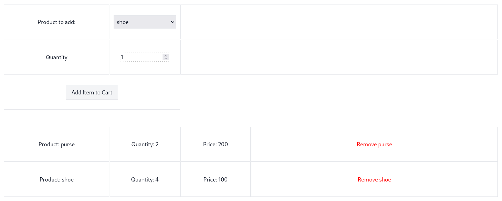

# ICE Global


## Introduction

`ICE Global` is a simple shopping cart manager that allows users to manage cart items. This project was part of an [interview refactor](https://git.ice.global/packages/golang-interview-refactor) for ICE Global.

The application is live at [https://ice-global.mohammadne.ir](https://ice-global.mohammadne.ir) 🚀



## Architecture Overview

The project is organized as follows:

```bash
> tree
.
├── cmd
│   ├── migration
│   │   └── schemas
│   ├── version.go
│   └── web-api
├── deployments
│   ├── docker
│   └── k8s
├── internal
│   ├── api
│   │   └── http
│   ├── config
│   ├── entities
│   ├── repositories
│   │   ├── cache
│   │   └── storage
│   └── services
└── pkg
    ├── mysql
    └── redis
```

### Continuous Integration (CI)

CI for this project is managed using `GitHub Actions`. The process builds the Docker image and uploads it to the `ghcr.io` registry.

### Deployments

The application can be deployed using `docker-compose`:

- **Local Development:** Use the `.local` compose file to resolve dependencies locally.
- **Production:** The `.prod` compose file is designed for deploying the application to a server.

Additionally, a Kubernetes setup (`k8s/`) is provided for deploying the application with `helmsman` and `helm` charts. The Kubernetes cluster is set up using `Kind`.

### API

The API layer currently only supports HTTP handlers. Template files are embedded using the `embed` package, replacing the previous design that used absolute paths, which caused deployment issues.

Although `Gin` was chosen as the HTTP engine, other high-throughput frameworks like `Fiber` (based on `fastHTTP`) could be used for more demanding systems. However, `Gin` is sufficient for this application’s needs.

A custom middleware was developed to handle cookie checking for users, improving code organization and maintainability.

> **Note:** The term `session` was incorrectly used for cookies in some parts of the code. This term was updated, but in the database, `session_id` remains unchanged for backward compatibility.

### Configuration

Configuration is managed using the `envconfig` package to avoid hardcoded values. For more complex use cases, tools like `koanf` could be used, but `envconfig` is sufficient for this project.

### Services

The `services` directory is designed to handle the business logic in the application, following Clean Architecture principles. The HTTP layer (e.g., `Gin`) is isolated from business logic, only handling queries, user input validation, and other presentation-layer concerns.

### Storage

MySQL is used as the primary database. Changes include:

1. Switching from `gorm` to raw SQL queries for improved performance and readability.
2. Developing migration logic to handle schema changes.

Benefits of using raw SQL:

- **Readability:** Queries are clearer and more intuitive.
- **Performance:** Raw SQL allows for better optimization, especially with complex queries.
- **Flexibility:** You can optimize SQL queries based on specific attributes.
- **DBA Friendly:** DBAs can easily understand and modify raw SQL.

### Cache

Redis is used for caching cart items, reducing the need to access the primary database on every request. Since Redis is an in-memory store, read and write operations are much faster compared to traditional databases like MySQL.

### Project Structure

In this project, the following structure is used:

- **`/pkg`**: Contains general-purpose packages like `mysql` and `redis`.
- **`/internal`**: Contains business logic and project-specific code.

This structure is recommended by the Go community, separating general utility code from domain-specific logic.

### Data Migration

To migrate the database schema, run the following command:

```sh
go run cmd/migration/main.go --direction up
```

This will apply the necessary schema changes.

Migration steps include:

1. Adding a relationship constraint between `cart_items.cart_id` and `cart_entities.cart_id`.
2. Creating a new `items` table for better organization and to avoid hardcoded values in the code.
3. Ensuring `session_id` is unique across tables.
4. Replacing the `total` column in `cart_entities` with a more normalized design.
5. Using `TIMESTAMP` instead of `DATETIME` for better tracking of changes over time.

### Why Migrations Were Necessary

Several issues in the original schema required migration:

1. The `cart_id` in the `cart_items` table had no foreign key constraint.
2. The `items` table was added to streamline the `cart_items` structure.
3. The `session_id` column should be unique across all related tables.
4. The `total` column in `cart_entities` made the table denormalized; this information can be derived from other related tables.
5. Using `TIMESTAMP` instead of `DATETIME` offers better tracking of changes over time.

### Tests

I have written unit tests for different modules, for mocking redis I have used `miniredis` and for sql database I have used the package `sqlmock`, also for mocking api calls to this repositories I have used the `testify` package to mock the behavior of this repositories.

For the service layer and the item's service I have added some `benchmark` tests to measure the performance altough this method uses the mocks and mocks do not represent real performance.

I have also added `k6` for the `load` testing.

So In my project, I have the following tests:

- unit tests
- benchmark tests
- load test
- integration tests

### Linting

I have used the `golangci lint` and in the test workflow of the github action I have a trigger for the lint part.
